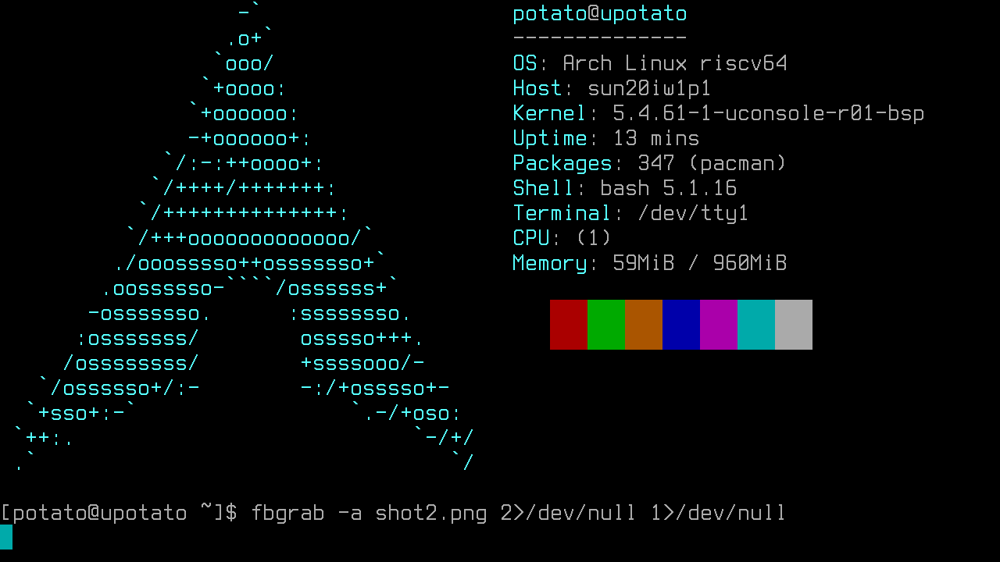

# uConsole/R-01 BSP Linux packaged



This is a ArchLinux package for uConsole/R-01, built with BSP toolchain.

> About how to download the BSP code, read: https://d1.docs.aw-ol.com/en/study/study_2getsdk/ . It requires an account. Every step fetching the code there is tested in a Ubuntu Jammy chroot.
> The tutorial may be not updated. Be flexible.

Kernel config is changed a little bit. BINFMT_MISC enabled, and I forget other changes.

Original instruction by ClockworkPi devs: https://github.com/clockworkpi/uConsole/blob/master/Code/patch/r01/20230614/README.md

## How to build this package?

This is a bit tricky under the hood. After installing all requirements, run the following command in linux-bsp:

```bash
makepkg -Cf
# -C: clean src
# -f: force rebuild
# -A: ignore architecture, but not required here
```

This is tested on a x86_64 ArchLinux host. (Yeah, it's a riscv64 package built on a x86_64 host XD.)

## Notes on common problems

### Setup bootloader

TBW in detail.

An example of `extlinux/extlinux.conf`:

```
default uc-arch-5.4.61

label uc-arch-5.4.61
        linux /vmlinuz-linux-uconsole-r01-bsp
        fdt /dtbs/sunxi/uc_board.dtb
        append root=/dev/mmcblk0p2 earlyprintk=sunxi-uart,0x02500000 clk_ignore_unused initcall_debug=0 earlycon=sbi console=ttyS0,115200 console=tty0 loglevel=3 cma=16M LANG=en_US.UTF-8 fbcon=rotate:1 rootwait vt.cur_default=0xF00058
```

__Use block path__ to refer your partitions. __DON'T USE UUIDs!__.

### Missing WiFi firmware

The firmware for the on board WiFi module AP6256(detected as BCM4345/9) is not included in `linux-firmware`.
The corresponding firmware(brcmfmac43456-sdio) can be installed with an AUR package(`brcmfmac43456-firmware`).

### How to enable the 4G module

It's simple, but still WIP.

### Want a cursor on framebuffer

R-01 doesn't have a hardware cursor(that's default), and you can use a cmdline parameter to change the default
to a softcursor.

Format:: `vt.cur_default=0x{p3}{p2}{p1}`, note the order.

Example: `vt.cur_default=0xF00058` white background block, with highlight.

<details>
  <summary>Explaination(click to expand):</summary>

- p1: shape & shape style
- p2: color bits to clear
- p3: color bits to set

Set(OR) happens before clear(XOR)

About shape:

```
0=default
1=invisible
2=underline
3=lower_third
4=lower_half
5=two_thirds
8=full block
+ 16 if you want the __software cursor__ to be applied
+ 32 if you want to always change the background color
+ 64 if you dislike having the background the same as the
     foreground.
```

About color bits:

```
It is a 8bit binary integer:

 0b MRGB MRGB
    |    |
    |    Foreground(text) color
    |
    Background

M: set 1 to highlight, or blink, depend on the implementation(softcursor, hardcursor, etc.)
R: bit for red
G: bit for green
B: bit for blue
```

</details>

### Want a bootloader(u-boot)

I haven't built a usable bootloader for the BSP kernel, so I simply copied one from the image
released by clockwork devs. See `bootloader-backup`.

## About hacks

### cross compile with makepkg

Well, you just need to inject code to trick makepkg that your current arch is riscv64,
and the rest is just shell scripting work.

### prebuild the kernel scripts

To workaround an issue with cross compiling, I prebuilt the kernel helper scripts and packed them in advance.

If you don't trust me(_DON'T TRUST ME_), you can generate the prebuilt scripts package by running
the following commands against the patched kernel source on a riscv64 host(or chroot):

```bash
make mrproper && make sun20iw1p1_d1_r01_defconfig && make scripts
tar c scripts | zstd > riscv64-prebuilt-scripts.tar.zst
```
